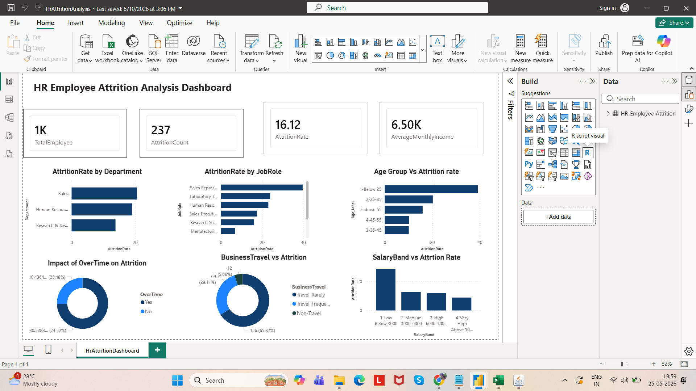
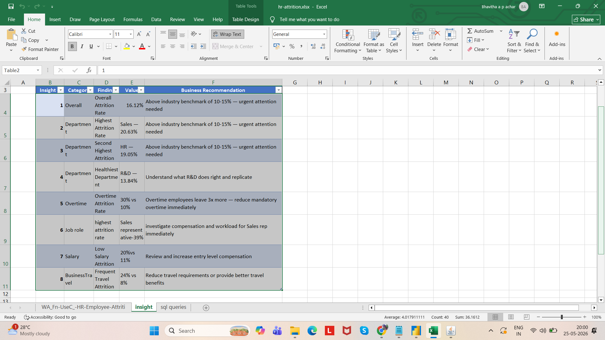

# HR Employee Attrition Analysis

## Objective
To analyze employee attrition patterns and identify the major factors contributing to workforce turnover using SQL and Power BI.

## Tools Used
- SQL
- Power BI
- Excel

## Analysis Performed
- Department-wise attrition analysis
- Job role attrition analysis
- Overtime impact on attrition
- Salary band vs attrition rate
- Business travel impact analysis
- Age group attrition analysis

## Key Insights
- Overall attrition rate was 16.12%, above the industry benchmark
- Sales department showed the highest attrition rate (20.63%)
- Employees working overtime had significantly higher attrition
- Sales Representatives had the highest attrition among job roles
- Lower salary bands experienced higher employee turnover
- Frequent business travel was strongly linked to attrition

## Business Recommendations
- Reduce excessive overtime policies
- Improve compensation for entry-level employees
- Review workload and incentives for sales teams
- Provide better support for employees with frequent travel

## Dashboard Preview

## Insights

